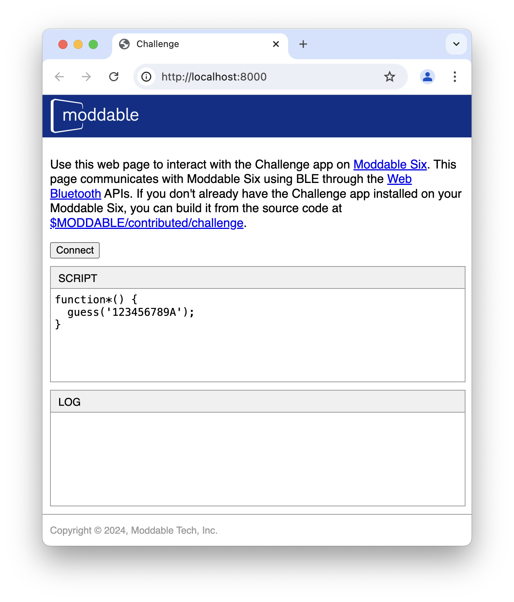
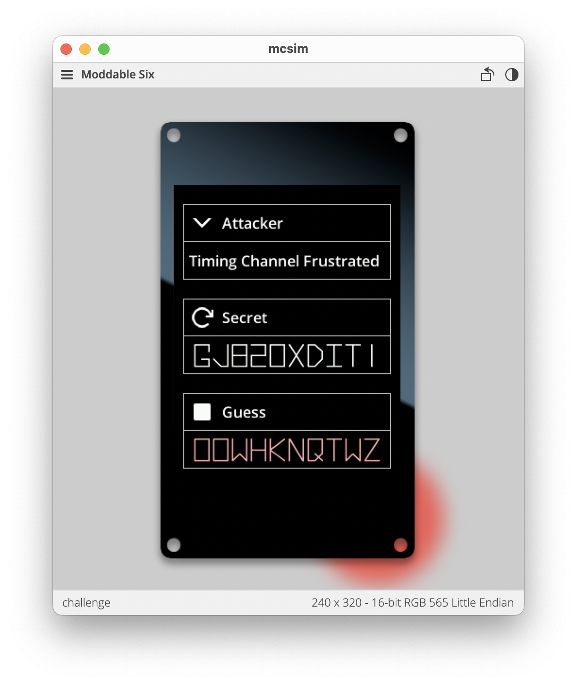

<link rel="stylesheet" href="../index.css">

The Embedded Challenge is a port of this site's [Web Challenge](https://hardenedjs.org/challenge/challenge) to [Moddable Six](https://www.moddable.com/moddable-six), an embedded device powered by the popular [ESP32-S3](https://www.espressif.com/en/products/socs/esp32-s3) microcontroller. The Embedded Challenge runs on the XS JavaScript engine. XS implements Hardened JavaScript natively, as part of the engine itself, including `lockdown()` and the `Compartment` class. The XS implementation of Hardened JavaScript is a completely separate implementation from the SES shim used by web-based Challenge.

## Running the Embedded Challenge

To run the Embedded Challenge, you'll need a Moddable Six (or equivalent) and a computer (macOS, Windows, or Linux) with the Moddable SDK and ESP-IDF installed. Use [xs-dev](https://xs-dev.js.org) to install the Moddable SDK with pre-built Moddable tool binaries:

```
> npm install -g xs-dev
> xs-dev setup
> xs-dev setup --device esp32
```

If you prefer to build the tools yourself, follow the directions to [install the Moddable SDK](https://moddable.com/documentation/Moddable%20SDK%20-%20Getting%20Started), build the tools, and [install the ESP-IDF](https://github.com/Moddable-OpenSource/moddable/blob/public/documentation/devices/esp32.md).

Either way, from there it is straightforward to build, install, and run the Embedded Challenge:

```
> cd $MODDABLE/contributed/challenge
> mcconfig -d -m -p esp32/moddable_six_cdc
```

The user interface shows the secret code and latest guess. It also allows you to run the example attacker scripts from the Hardened JavaScript web page. Here's a video that shows the app running on Moddable Display 6:

[](https://www.youtube.com/embed/kUOTjM-oymw)

You can run your own attack scripts too.  To do that, you'll use a local web page and BLE to communicate with the Moddable Six.

1. Start-up a web server

	```
	> cd $MODDABLE/contributed/challenge/web
	> python3 -m http.server 8080
	```

2. Launch Chrome (Chrome is currently the only browser that implements Web BLE)
3. Open the web page at `http://localhost:8080`
4. Press the "Connect" button to establish a connection to the embedded device
5. Enter your attack script
6. Press the "Attack" button to run the script on the embedded device



## Simulating the Embedded Challenge

The Embedded Challenge also runs on macOS, Windows, and Linux using the `mcsim`, the Moddable SDK's simulator. This allows you to try out the Embedded Challenge while waiting for your embedded device to be delivered. To run the Embedded Challenge in the simulator, install the Moddable SDK and then:

```
> cd $MODDABLE/contributed/challenge
> mcconfig -d -m -p sim/moddable_six
```



The application works exactly the same. However, BLE is unavailable so you cannot download your own attack scripts. You can edit the source code of built-in scripts, however, to try various attacks. While running in the simulator, the [xsbug JavaScript debugger](https://moddable.com/documentation/xs/xsbug) is available to debug your attacks and explore the runtime environment.

## Hints for Attackers
Because the Embedded Challenge is running on a different device with a different JavaScript engine, an attacker has different potential avenues of attack. For example,  XS implements ECMAScript 2024 with some engine-specific extensions plus the Hardened JavaScript APIs, so the attacker has a wide-array of language syntax and built-in APIs available to find a vulnerability to exploit. Also, because scripts are running on a resource constrained device with about 8.5 MB of RAM, it is easy to generate out of memory failures and to overflow both the native and JavaScript stacks. XS should successfully defend against these attacks by terminating execution. Limited memory also means that the garbage collector is likely to run more frequently, potentially making it easier to exploit any vulnerabilities it has or may trigger.

The secret key is stored in the module global `model` of the "main" module as `model.SECRET.string`. `SECRET` is a [Label object](https://moddable.com/documentation/piu/piu#label-object) in the [Piu](https://moddable.com/documentation/piu/piu) user interface framework. An attacker that can gain access to the module scope or the Piu object graph, for example through the `application` global, could exploit either to easily reach the secret. Fortunately, Hardened JavaScript prevents this by isolating the attacker's script in a Compartment that does not have access to either.

Additional information about the XS JavaScript engine that may be useful to attackers is available on the [Hardening the XS JavaScript Engine](https://www.moddable.com/hardening-xs) page.

## Success?!?
If you are able to successfully attack the Embedded Challenge, Moddable wants to hear about it! Check out Moddable's [Vulnerability Disclosure Policy](https://www.moddable.com/hardening-xs#vdp).

## Source Code
The Embedded Challenge is included in the the Moddable SDK v5.0 and later at [$MODDABLE/contributed/challenge](https://github.com/Moddable-OpenSource/moddable/tree/public/contributed/challenge).
